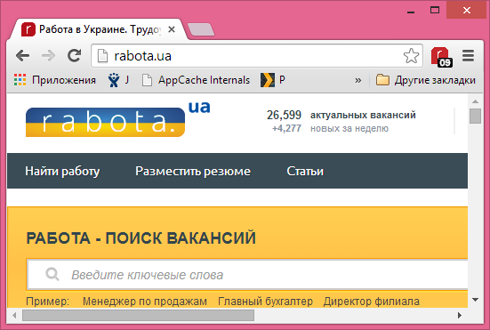

This is sample extension showing how you can debug which server is responding to your request

Installation
============

1. Download TODO: link here
2. Navigate to [chrome://extensions/](chrome://extensions/) in chrome browser
3. Drag'n'drop downloaded file to browser

